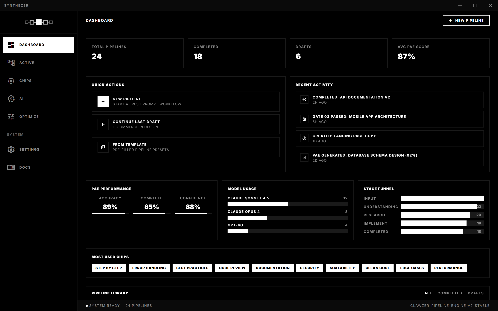
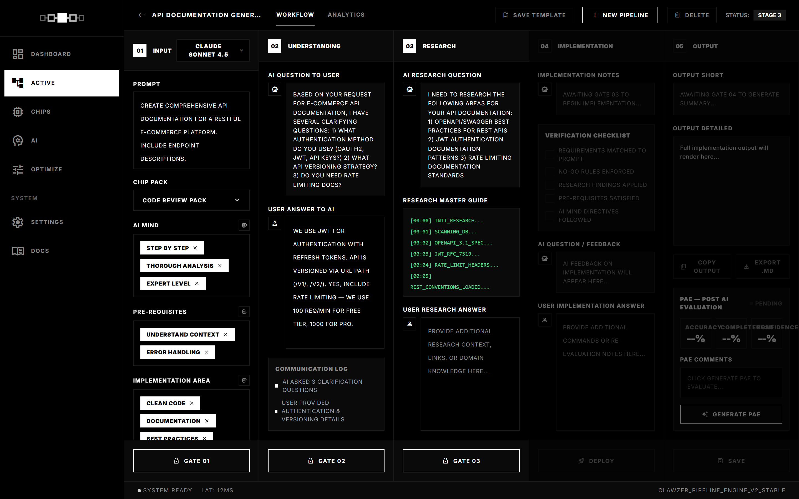
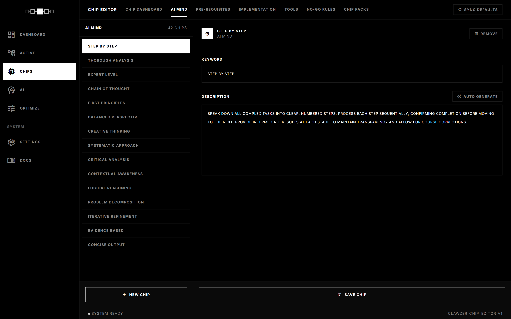

<p align="center">
  <picture>
    <source media="(prefers-color-scheme: dark)" srcset="assets/readme/logo-dark.svg">
    <source media="(prefers-color-scheme: light)" srcset="assets/readme/logo-light.svg">
    
  </picture>
</p>

# SYNTHEZER

**Transform vague ideas into bulletproof prompts. 5 stages. Zero guesswork.**

[](LICENSE)
[](https://nodejs.org)
[](#stack)
[](https://github.com/mervanhasancalik/synthezer/actions)

---

A **local-first** desktop application for professional prompt engineering. Synthezer guides you through a 5-stage gated pipeline — from raw idea to polished, verified output — with chip-based behavioral configuration and AI self-evaluation.

All your data stays on your machine. No cloud accounts. No telemetry.

<br>

<p align="center">
  
</p>

<br>

## The Pipeline

Each pipeline runs through 5 gated stages. The AI must confirm understanding before you can progress — no shortcuts, no guesswork.

```
┌─────────┐     ┌───────────────┐     ┌──────────┐     ┌────────────────┐     ┌────────┐
│  INPUT   │────▶│ UNDERSTANDING │────▶│ RESEARCH │────▶│ IMPLEMENTATION │────▶│ OUTPUT │
│          │     │               │     │          │     │                │     │  + PAE │
│ Prompt + │     │ AI clarifies  │     │ Research │     │ Plan +         │     │ Final  │
│ Chips    │     │ intent        │     │ context  │     │ checklist      │     │ result │
└─────────┘     └───────────────┘     └──────────┘     └────────────────┘     └────────┘
    01               02                   03                 04                   05
```

| Stage | Gate | What happens |
|:------|:-----|:-------------|
| **01 — Input** | → | Enter your prompt, select behavioral chips from 180+ in the library |
| **02 — Understanding** | Gate 1 | AI asks clarifying questions, confirms it understands your intent |
| **03 — Research** | Gate 2 | AI generates research directives, you provide supporting context |
| **04 — Implementation** | Gate 3 | AI creates a verification checklist and implementation plan |
| **05 — Output** | Gate 4 | AI produces the final output, then self-evaluates with PAE scoring |

<br>

## Features

- **5-Stage Gated Pipeline** — Structured progression from idea to verified output
- **180 Behavioral Chips** — 5 categories (`ai_mind`, `prerequisite`, `implementation`, `tools`, `no_go`) to shape AI behavior
- **PAE Scoring** — Post AI Evaluation: accuracy, completeness, and confidence self-assessment
- **Local-First** — SQLite database, no cloud dependency, your data never leaves your machine
- **Local AI** — Ollama, LM Studio, vLLM, llama.cpp, or any local inference server
- **OpenClaw Gateway** — Native support for OpenClaw's dual-path architecture via CLI adapter
- **Profile Export/Import** — Back up and transfer all your pipelines, chips, and settings
- **Cross-Platform** — Windows (NSIS), macOS (DMG), Linux (AppImage)
- **Zero Build Step** — No bundlers, no transpilers, no compile step

<br>

<p align="center">
  
</p>

<br>

## Quick Start

```bash
git clone https://github.com/mervanhasancalik/synthezer.git
cd synthezer
npm install
npm start
```

The app opens an Electron window with the server at `http://localhost:8090`.

### Run Modes

| Command | What it does |
|:--------|:-------------|
| `npm start` | Desktop app (Electron + Express) |
| `npm run server` | Server only — access via browser at localhost:8090 |
| `npm run dev` | Development mode with `--watch` |
| `npm run dist` | Build desktop installers |
| `npm test` | Run test suite |

<br>

## Chip System

Chips are behavioral instructions that shape how the AI processes your pipeline. Select any combination to customize the AI's approach.

<p align="center">
  
</p>

| Category | Count | Purpose |
|:---------|:------|:--------|
| `ai_mind` | 47 | Core AI behavior and reasoning patterns |
| `prerequisite` | 36 | Required context and preparation steps |
| `implementation` | 52 | Code, structure, and execution guidelines |
| `tools` | 25 | Tool usage and integration directives |
| `no_go` | 20 | Explicit constraints and boundaries |

Create your own chips, import/export chip packs, or use the built-in library of 180.

<br>

## Architecture

```
frontend/index.html    ← Single-file SPA (vanilla JS + Tailwind CDN)
serve.js               ← Express 5 server
routes/
  pipeline.js          ← 5-stage gate + stage handlers
  chips.js             ← Chip CRUD, packs, import/export
  profile.js           ← Stats, profile export/import
lib/
  ai.js                ← AI gateway proxy + multimodal support
  openclaw-adapter.js  ← OpenClaw CLI wrapper
  prompts.js           ← Structured prompts per stage/gate
  db.js                ← SQLite operations (better-sqlite3)
electron/main.cjs      ← Electron process + server startup
db/
  schema.sql           ← 10 tables
  chips.seed.json      ← Default chip library (180 chips)
```

<span id="stack"></span>

### Stack

| Layer | Technology |
|:------|:-----------|
| Frontend | Vanilla JavaScript, Tailwind CSS (CDN), Inter font |
| Backend | Node.js, Express 5 |
| Database | SQLite via better-sqlite3 (WAL mode) |
| Desktop | Electron |
| AI | Local models (Ollama, LM Studio, vLLM), OpenClaw Gateway |

**5 production dependencies.** That's it.

<br>

## Configuration

Copy `.env.example` to `.env` to customize:

| Variable | Default | Purpose |
|:---------|:--------|:--------|
| `SYNTHEZER_PORT` | `8090` | Server port |
| `SYNTHEZER_HOST` | `0.0.0.0` | Bind address |
| `SYNTHEZER_DB_PATH` | `~/.Synthezer/synthezer.db` | Database location |

AI gateway credentials are entered in the app UI — no API keys in environment variables.

<br>

## AI Providers

Synthezer connects to local AI providers and OpenClaw Gateway:

- **Ollama** — localhost:11434
- **LM Studio** — localhost:1234
- **vLLM** — localhost:8000
- **llama.cpp / LocalAI** — localhost:8080
- **Jan / GPT4All** — and other local inference servers
- **OpenClaw Gateway** — auto-detected on port 18789/19001, uses CLI adapter for session management

Configure your provider in the app's AI settings panel. Auto-detection scans for running local providers.

<br>

## Contributing

See [CONTRIBUTING.md](CONTRIBUTING.md) for guidelines. The project follows a zero-build-step philosophy with vanilla JS and minimal dependencies.

## Security

See [SECURITY.md](SECURITY.md) for the vulnerability reporting policy. Supported version: 3.0.x.

<br>

---

<p align="center">
  <sub>MIT License — Copyright (c) 2025-2026 Mervan Hasan Calik</sub>
</p>
